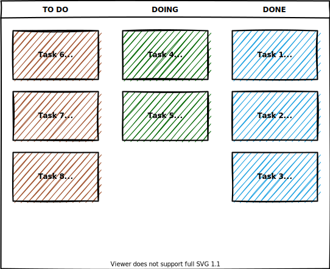

# Кейс:

У вас есть трёхкомнатная квартира, в которой не было ремонта последние 20 лет. Вместе с друзьями вы хотите сделать в ней современный ремонт, выстроив работу по Scrum.

1. Опишите, как вы организуете работу над проектом по фреймворку Scrum.
2. Сформируйте Product Backlog.
3. Разделите все работы на спринты.
4. Сформируйте Sprint Backlog одного любого спринта.
5. Нарисуйте Scrum-доску и покажите на ней, как организована работа над задачами этого спринта.

***
# Решение.

1. ## Организация работы над проектом.

   Команда из 6 друзей, включая меня. В моём лице одновременно и закачик, и скрам-мастер. Составляем бэклог с моими "хотелками". Уровень мастерства примерно одинаков у всех, каждый умеет делать любую работу. Спринты длительностью 1 неделя и ежедневные утренние собрания для распределения текущих задач и обратной связи.

2. ## Product Backlog.

   1. Демонтаж обоев во всех комнатах и коридоре, покрытий стен в ванной, туалете и кухне. Демонтаж половых покрытий (линолеум) везде, где он постелен.
   2. Отделка и выравнивание стен и полов во всех помещениях квартиры, окраска потолков.
   3. Выбор материалов (обои, пполовые покрытия, плитка в ванную, туалет и кухню) на вкус заказчика.
   4. По мере необходимости закупка материалов, чтобы не было простоя.
   5. Чистовая отделка - настил полов, оклейка обоями, отделка плиткой ванны, туалета, кухни.

3. ## Спринты. Sprint Backlog первого спринта.
   
   Все задачи бэклога в данном случае уже разбиты на спринты при его планировнии. В спринте задача разбивается на более мелкие по длительности для возможности выполнения за день-два одним человеком и более гибкого планирования спринта.

   ### Спринт 1: Цель - демонтировать всё, что нужно.
   1. Демонтаж обоев и пола в первой комнате.
   2. Демонтаж обоев и пола во второй комнате.
   3. Демонтаж обоев и пола в третьей комнате.
   4. Демонтаж обоев и пола в коридоре.
   5. Демонтаж старых покрытий в ванной.
   6. Демонтаж старых покрытий в туалете.
   7. Демонтаж старых покрытий на кухне.
   8. Закупка необходимых материалов и инструментов.
 
   ### Спринт 2: Цель - выполнить черновую отделку.

   1. Отделка и выравнивание стен и полов в первой комнате.
   2. и т.д. с остальными помещениями...   
   
   ### Спринт 3: Цель - выполнить чистовую отделку.
   1. Окраска потолка, оклейка обоями и укладка линолеума в первой комнате.
   2. Окраска потолка, укладка плитки в ванной на стены и пол.
   3. и т.д. с остальными помещениями...
   
4. ## Sprint Backlog первого спринта.
   Указан ранее.

5. ## Scrum-доска первого спринта.
   

***

# Ответ преподавателя:

Добрый день, Дмитрий!
По домашнему заданию всё верно.
Только на Scrum-доске необходимо добавить столбец In test перед столбцом Done - туда Вы будете перемещать выполненные задачи для их тестирования и только после этого уже перемещать их в столбец Done.
