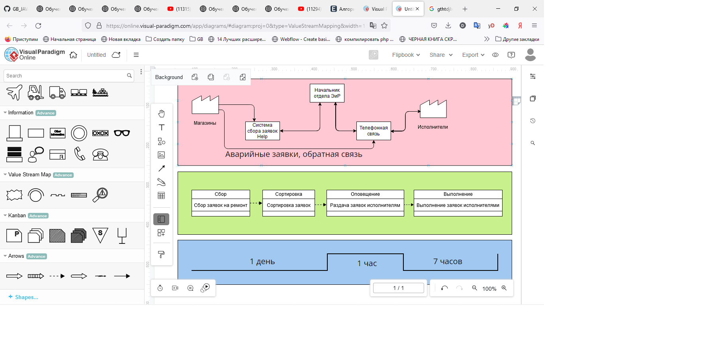

# Кейс:

Проанализируйте свою повседневную работу или работу отдела в вашей компании на наличие потерь.

1. Нарисуйте VSM-карту.
2. Найдите потери и классифицируйте их в соответствии с материалом лекции.
3. Подумайте, как исключить эти потери.
4. Нарисуйте новую VSM-карту в соответствии с вашими предложениями.

***
# Решение.

Рассмотрена работа отдела Эксплуатации и Развития (ОЭиР) сети продовольственных магазинов (универсамов).

1. 
2. 3. 4. Не смог найти потери и, соответственно, исключать нечего. Производственный процесс максимально оптимизирован. Автоматизировать процесс сортировки заявок невозможно, поскольку заказчики технически неграмотны и не могут правильно классифицировать исходящие заявки. Возможности-же их обучения ограничены и неэффективны, поскольку они постоянно находятся в процессе обучения по своим непосредственным обязанностям (торговля) и их производственный процесс гораздо более важен. Также в реальности заявки, бывает, при их общем малом количестве либо близости исполнителя к магазину выпролняются в тот-же день. Есть заявки, для которых необходимо больше ресурсов и таковые направляются на выполнение после сбора ресурсов (покупка материалов, несколько исполнителей на одну заявку и т.д.). Рассчитать время выполнения однотипных на первый взгляд заявок так-же невозможно рассчитать, не оценив предварительно на месте. Например, заявка "Установить розетку" может занимать 5 минут (новую розетку на место старой), а может занять целый день (протяжка линии к электрическому щиту, расключение, монтаж). Соответственно и уменьшить время выполнения трудно - всё зависит от квалификации конкретного мастера, его опыта и сложности работ. В общем, резюмируя, я считаю, что данная система достаточно совершенна в целом и в ней нечего улучшать при достаточной мотивации исполнителей).