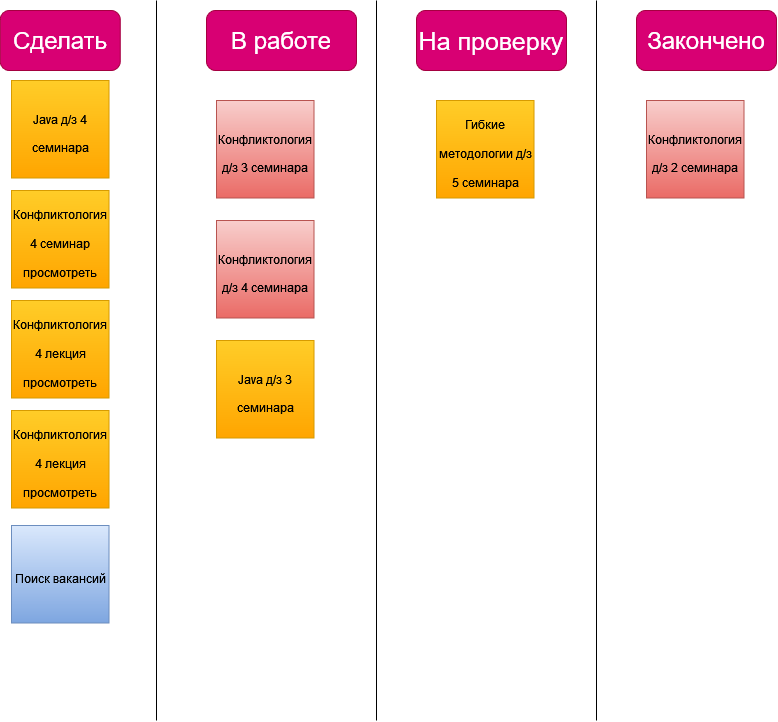

# Кейс:

Домашнее задание
Проанализируйте свой процесс обучения в ИТ-сфере и продвижение по карьере в этом
направлении. Выделите задачи, которые стоят перед Вами на месяц/квартал/год (на Ваше
усмотрение). Ранжируйте поставленные задачи по классам обслуживания – выберите цвета
для Kanban-карточек. Определите WiP для управления потоком незавершённых задач.
Отразите определённые Вами задачи на личной Kanban-доске.

***
# Решение.

1. 
2. 

***

Оценка преподавателя: Доброе утро, Дмитрий!
Канбан-доску выполнили верно - отлично!
Только над столбцом "В работе" нужно проставить WIP-лимиты (количество задач, которые находятся одновременно в работе).